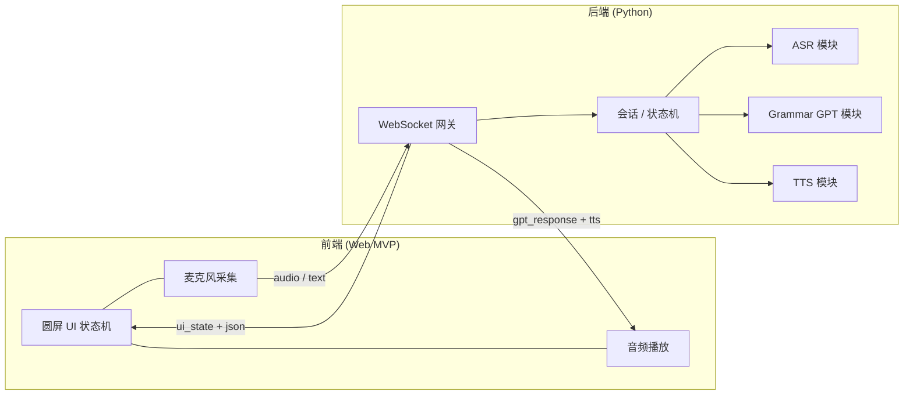

# GrammarBuddy 本地 MVP 解决方案 v0.3

> 目标：在本机先跑通「网页前端 + Python 后端」的完整学习闭环，验证产品与协议；StopWatch 固件作为独立客户端并行开发。
>
> **三端总方案（v0.4，推荐阅读）**：[three_client_solution_v0.4.md](./three_client_solution_v0.4.md)  
> **Launcher 集成**：[launcher_integration_v0.2.md](./launcher_integration_v0.2.md)
>
> 关联文档：
> - [m5stack_ai_core_design_full_v0.1.md](./m5stack_ai_core_design_full_v0.1.md)
> - [m5stack_stopwatch_ui_spec_v0.1.md](./m5stack_stopwatch_ui_spec_v0.1.md)
> - [qwen_api_stack_survey_v0.1.md](./qwen_api_stack_survey_v0.1.md)（千问 API 调研）

---

## 0. 已确认决策

| # | 议题 | v0.2 决定 | v0.3 调整（2026-06-13） |
|---|------|-----------|-------------------------|
| 1 | 前端框架 | React 18 + TS + Vite | **不变** |
| 2 | AI 供应商 | OpenAI GPT + TTS | **阿里云百炼 DashScope / 千问 Qwen3.5**（技术约束） |
| 3 | ASR | 浏览器 Web Speech API | **MVP 仍用浏览器 ASR**；千问 ASR 作为 Phase 2b 可选升级（见 §0.2） |
| 4 | TTS | OpenAI TTS | **千问 Qwen-TTS**（`qwen3-tts-flash`，后端合成） |
| 5 | 用户系统 | 单会话 | **不变** |
| 6 | 语法主题 | JSON 模板 + 用户自定义 | **不变** |

### 0.1 语音分工（v0.3）

| 环节 | MVP 方案 | 模型 / API |
|------|----------|------------|
| 语法大脑 | 后端 DashScope | **`qwen3.5-plus`** + JSON Mode |
| ASR | 浏览器 Web Speech API → `asr_final` | 暂不调用千问 ASR（最快跑通） |
| TTS | 后端 DashScope | **`qwen3-tts-flash`**，`language_type=English` |

数据流：`麦克风 → 浏览器 ASR → text → WebSocket → Qwen3.5 → Qwen-TTS → audio → 扬声器`。

**为何 ASR 暂留浏览器？** 千问 ASR 能力完整（见 §0.2），但实时 WebSocket 接入比浏览器 ASR 多一层后端音频转发；MVP 先验证教学闭环，Phase 2b 再切 **`qwen3-asr-flash-realtime`**，与 M5Stack 路径对齐。

### 0.2 千问 API 是否有 ASR / TTS？（调研结论）

**有，且都在同一百炼平台（DashScope），共用 `DASHSCOPE_API_KEY`。** 但它们与 `qwen3.5-plus` 文本模型是**独立 API 产品**，不是在一个 chat 接口里顺带完成语音识别/合成。

| 能力 | 是否提供 | 推荐模型 | 调用方式 |
|------|----------|----------|----------|
| **文本 / 语法纠错** | ✅ | `qwen3.5-plus` 或 `qwen3.5-flash` | OpenAI 兼容 `/compatible-mode/v1` 或 DashScope 多模态接口；`response_format: json_object` |
| **TTS 非实时** | ✅ | `qwen3-tts-flash` | `MultiModalConversation.call(text=..., voice=..., language_type="English")` |
| **TTS 实时** | ✅ | `qwen3-tts-instruct-flash-realtime` 等 | WebSocket 实时合成 |
| **TTS 语调控制** | ✅ | `qwen3-tts-instruct-flash` | `instructions` 参数，如「语速较慢、温和、适合儿童英语教师」 |
| **ASR 非实时** | ✅ | `qwen3-asr-flash` | 文件/URL 异步转写 |
| **ASR 实时** | ✅ | `qwen3-asr-flash-realtime` | WebSocket，`input_audio_buffer.append` 流式送 PCM |

官方文档入口：
- TTS：[非实时语音合成（Qwen-TTS）](https://help.aliyun.com/zh/model-studio/non-realtime-tts-user-guide)
- ASR 实时：[Qwen-ASR-Realtime](https://help.aliyun.com/zh/model-studio/qwen-asr-realtime-python-sdk)
- 结构化 JSON：[千问结构化输出](https://help.aliyun.com/zh/model-studio/qwen-structured-output)

**GrammarBuddy 相关要点：**
- TTS 支持 **`language_type="English"`**，适合美国小学英语场景；可选音色如 `Cherry` 等（见百炼音色列表）。
- ASR 支持多语种（含英语），实时版支持 VAD 自动断句，适合 LISTENING 状态。
- `qwen3.5-plus` 默认可能开启思考模式；语法 JSON 输出须 **`enable_thinking=false`**，否则无法使用 JSON Mode。
- 详细 API 对比、代码示例、迁移路径见 **[qwen_api_stack_survey_v0.1.md](./qwen_api_stack_survey_v0.1.md)**。

---

## 1. 项目理解摘要

### 1.1 产品定位

GrammarBuddy 是一款面向**美国小学水平**（文档示例为 Grade 3）的**实时英语语法学习**设备/应用。核心体验是「说 → 听 → 改 → 练」的语音闭环，而不是传统的选择题或填空题。

### 1.2 系统角色（四件套）

| 角色 | 职责 | MVP 实现 | 硬件阶段 |
|------|------|----------|----------|
| **Qwen（大脑）** | 语法评估、纠错、讲解、下一题 | **DashScope `qwen3.5-plus`** + JSON Mode | 同左 |
| **UI（黑板）** | 按状态渲染句子、高亮、提示 | Web 圆屏模拟器 | M5Stack + LVGL |
| **ASR（耳朵）** | 语音转文字 | 浏览器 Web Speech → 文本；可选 **`qwen3-asr-flash-realtime`** | 设备麦克风 + 千问 ASR |
| **TTS（嘴巴）** | 语音反馈、跟读示范 | **`qwen3-tts-flash`** 后端合成 | 设备扬声器 + 千问 TTS |

### 1.3 核心交互闭环

```text
用户说话
  → ASR 识别文本
  → GPT 返回结构化教学 JSON
  → UI 按 ui_state 渲染（错误红 / 正确绿 / Tip 灰）
  → TTS 播放鼓励语 + 示范句
  → 用户复述（PRACTICE）
  → 下一题或回到 HOME
```

### 1.4 UI 状态机（与文档一致）

```text
HOME → LISTENING → THINKING → FEEDBACK → PRACTICE → (下一题 / HOME)
```

参考 UI 稿（9 屏流程）：Home → Listening → Thinking → Feedback → Tip → Practice → Your Turn → Great Job → Next。

MVP 可将 **Tip** 合并进 FEEDBACK 页（文档 FEEDBACK 已含 Tip）；**Great Job** 作为 PRACTICE 成功后的子状态或短暂过渡屏。

---

## 2. 总体架构

### 2.1 设计原则

1. **协议先行**：前后端只通过 WebSocket + JSON 通信，与 [PART 2 通信协议](./m5stack_ai_core_design_full_v0.1.md) 对齐，便于 M5Stack  later 只换「传输层/UI 层」。
2. **后端集中智能**：ASR/GPT/TTS 逻辑放在 Python 服务；前端只负责采集音频、展示 UI、播放音频。
3. **语音分层**：ASR 在浏览器、TTS 在后端；GPT 与 TTS 必通；硬件阶段 ASR 可切到服务端 Whisper，协议不变。
4. **圆屏 UI 在 Web 先验证**：用 CSS 圆形 viewport 模拟 M5Stack StopWatch，视觉规范直接复用 UI spec 色值与层级。

### 2.2 逻辑架构图



### 2.3 部署形态（本机 MVP）

```text
GrammarBuddy/
├── backend/          # Python FastAPI + WebSocket
│   └── app/config/lessons/   # 语法主题 JSON 模板
├── frontend/         # Vite + React + TS 圆屏 Web App
└── docs/
```

开发时：

- 后端：`http://localhost:8000`（REST 健康检查 + WebSocket `/ws/session`）
- 前端：`http://localhost:5173`（Vite dev server，代理 WS 到 8000）

---

## 3. 技术选型建议

### 3.1 后端：Python + FastAPI

| 项 | 选择 | 理由 |
|----|------|------|
| Web 框架 | **FastAPI** | 原生 async、WebSocket 支持好 |
| LLM | **`qwen3.5-plus`**（DashScope） | JSON Mode 输出教学结构；关闭 thinking |
| SDK | **`dashscope`** Python SDK | TTS 用 `MultiModalConversation`；LLM 可用 OpenAI 兼容客户端 |
| ASR | **浏览器 Web Speech API**（MVP） | 千问 ASR 见 Phase 2b |
| TTS | **`qwen3-tts-flash`** | 非实时 HTTP；支持 English；流式返回 base64 或 URL |
| 会话存储 | **内存 dict**（单会话） | 无登录 |
| Lesson 配置 | **`backend/app/config/lessons/*.json`** | 内置 + 用户自定义 |
| 环境配置 | **pydantic-settings + .env** | `DASHSCOPE_API_KEY` 不入库 |

### 3.2 前端：Vite + React + TypeScript

| 项 | 选择 | 理由 |
|----|------|------|
| 构建 | **Vite** | 轻量、HMR 快 |
| UI 框架 | **React 18** | 状态机 + 组件化清晰 |
| 样式 | **Tailwind CSS** 或 CSS Modules | 快速实现 Apple 风暗色圆屏 |
| 状态 | **useReducer** 或 **XState**（可选） | 与文档 UI_STATE 枚举一一对应 |
| 通信 | 原生 **WebSocket** | 与 M5Stack 未来 C 端协议一致 |
| 圆屏 | 固定 **240×240 或 360×360** 圆形容器 + `border-radius: 50%` + `overflow: hidden` | 对齐 M5Stack Dial 类设备 |

### 3.3 共享契约

- 在 `shared/schemas/` 或 `backend/app/schemas/` 定义 **Pydantic 模型**，并导出 JSON Schema 供前端 TypeScript 类型生成（可选 `datamodel-code-generator`）。
- **单一真相来源**：GPT 输出结构、WebSocket envelope、UI 状态枚举。

---

## 4. 通信协议（MVP 细化）

与 [m5stack_ai_core_design_full_v0.1.md](./m5stack_ai_core_design_full_v0.1.md) 保持一致，并补充 MVP 必要字段。

### 4.1 WebSocket Envelope

```json
{
  "type": "control | asr | gpt | tts | error",
  "session_id": "uuid",
  "payload": {}
}
```

### 4.2 会话建立

**Client → Server**

```json
{
  "type": "control",
  "payload": {
    "action": "start_session",
    "grade": 3,
    "mode": "grammar_practice",
    "lesson_id": "past_simple"
  }
}
```

`lesson_id` 对应 `backend/config/lessons/` 下的模板；也支持 `lesson_custom`（见 §4.7）。

**Server → Client**

```json
{
  "type": "control",
  "payload": {
    "action": "session_started",
    "session_id": "uuid",
    "ui_state": "HOME",
    "lesson": {
      "id": "past_simple",
      "display_name": "一般过去时",
      "display_name_en": "Past Simple"
    }
  }
}
```

### 4.3 用户发起一轮（从 HOME / PRACTICE）

**路径 A — 文本模式（MVP 最快）**

```json
{
  "type": "asr",
  "payload": {
    "action": "asr_final",
    "text": "He go to school yesterday.",
    "confidence": 0.94
  }
}
```

**路径 B — 音频模式（阶段 B）**

```json
{
  "type": "asr",
  "payload": {
    "action": "audio_chunk",
    "format": "webm/opus",
    "data_base64": "..."
  }
}
```

Server 收到后：`ui_state → THINKING` → 调 GPT → 返回 gpt + tts。

### 4.4 GPT 响应（Server → Client）

与文档 PART 1 输出对齐，**前端只认此结构渲染**：

```json
{
  "type": "gpt",
  "payload": {
    "ui_state": "FEEDBACK",
    "evaluation": {
      "is_correct": false,
      "score": 65
    },
    "asr_text": "He go to school yesterday.",
    "correction": {
      "correct_sentence": "He went to school yesterday.",
      "error_type": "past_tense",
      "highlight": {
        "wrong": ["go"],
        "correct": ["went"]
      }
    },
    "teaching": {
      "simple_explanation": "We use 'went' for past time.",
      "kid_explanation": "Yesterday means past, so we say went."
    },
    "tts": {
      "primary": "Good try! Let's fix it together.",
      "repeat_prompt": "Now you try!"
    },
    "next_step": {
      "action": "REPEAT",
      "question": "What did you do yesterday?"
    }
  }
}
```

### 4.5 TTS 响应（Qwen-TTS，MVP 默认）

GPT 返回后，后端对 `tts.primary` 调用 **`qwen3-tts-flash`**，再推送：

```json
{
  "type": "tts",
  "payload": {
    "field": "primary",
    "format": "wav",
    "data_base64": "..."
  }
}
```

也可先返回 OSS **`url`**（24 小时有效），由前端直接播放 URL。流式模式可边合成边下发 base64 chunk。

### 4.6 前端状态推进（control）

用户点击「下一题 / 继续」：

```json
{
  "type": "control",
  "payload": { "action": "next_step" }
}
```

Server 可返回新的 `next_step.question` 并将 `ui_state` 设为 `HOME` 或 `LISTENING`。

### 4.7 语法主题：选择内置或用户自定义

**列出可用主题**（REST，会话前调用）：

```http
GET /api/lessons
```

```json
{
  "lessons": [
    { "id": "past_simple", "display_name": "一般过去时", "display_name_en": "Past Simple" },
    { "id": "present_continuous", "display_name": "现在进行时", "display_name_en": "Present Continuous" }
  ]
}
```

**用户自定义主题**（Client → Server，`start_session` 或单独 `set_lesson`）：

```json
{
  "type": "control",
  "payload": {
    "action": "start_session",
    "grade": 3,
    "lesson_custom": {
      "display_name": "将来进行时",
      "grammar_focus": "future continuous tense",
      "description": "表示将来某时刻正在进行的动作，结构 will be + verb-ing",
      "example_patterns": ["I will be studying at 8pm.", "She will be working tomorrow."],
      "starter_questions": ["What will you be doing tonight?"],
      "error_hints": ["will be + -ing", "don't use will + base verb alone for ongoing future"]
    }
  }
}
```

后端将 `lesson_custom` 规范化写入当前 session（**不持久化到库**，MVP 单会话够用）；若提供 `lesson_id` 则加载 JSON 文件，**二者互斥，优先 `lesson_id`**。

---

## 5. GPT 教学模块设计

### 5.1 System Prompt 要点

- 角色：耐心、简短的美国小学英语老师。
- **必须**输出合法 JSON，字段与 schema 一致。
- 面向儿童：`kid_explanation` 用简单词，避免语法术语堆砌。
- `highlight.wrong / correct` 必须是原句中可定位的词（供 UI 着色）。
- 根据 `grade` 与 **当前 lesson 模板**（`grammar_focus`、`error_hints` 等）调整评估与讲解。
- 用户自定义描述（如「将来进行时」）通过模板注入 prompt，**不要求**预置 enum。

### 5.2 输入

```json
{
  "user_text": "He go to school yesterday",
  "grade": 3,
  "mode": "grammar_practice",
  "lesson": {
    "id": "past_simple",
    "grammar_focus": "simple past tense",
    "description": "Actions completed in the past; often with yesterday, last week.",
    "starter_questions": ["What did you do yesterday?"],
    "error_hints": ["regular: -ed", "irregular: go → went"]
  },
  "session_context": {
    "previous_question": "What did you do yesterday?",
    "attempt": 1
  }
}
```

`lesson` 对象由后端从 JSON 模板或 `lesson_custom` 解析后填入，GPT 模块只读结构化字段。

### 5.3 复述判定（PRACTICE）

用户再次说话后，GPT 第二次调用模式改为 `mode: "repeat_check"`：

- 比较用户复述与 `correct_sentence`（语义等价即可，不要求逐词）。
- 正确 → `ui_state: "PRACTICE_SUCCESS"`（对应 UI 稿 Great Job），`evaluation.is_correct: true`。
- 错误 → 回到 FEEDBACK，缩短 explanation。

### 5.4 Lesson 模板 JSON（后端可配置）

路径：`backend/config/lessons/<lesson_id>.json`。启动时加载并校验（Pydantic）；支持热加载（开发模式可选）。

**Schema 示例** — `past_simple.json`：

```json
{
  "id": "past_simple",
  "display_name": "一般过去时",
  "display_name_en": "Past Simple",
  "grammar_focus": "simple past tense",
  "description": "描述过去已完成的动作或状态。",
  "description_en": "Actions or states completed in the past.",
  "example_patterns": [
    "I walked to school yesterday.",
    "She went to the park last Sunday."
  ],
  "starter_questions": [
    "What did you do yesterday?",
    "Where did you go last weekend?"
  ],
  "error_hints": [
    "Use past form: go → went, eat → ate",
    "Time words: yesterday, last week, ago"
  ],
  "kid_friendly_rule": "When it already happened, use the 'past' word for the action.",
  "grade_range": [2, 5]
}
```

**内置 MVP 建议包**（可增删，仅改 JSON 文件）：

| lesson_id | 显示名 |
|-----------|--------|
| `past_simple` | 一般过去时 |
| `present_continuous` | 现在进行时 |
| `future_simple` | 一般将来时 |
| `future_continuous` | 将来进行时 |
| `past_continuous` | 过去进行时 |
| `present_perfect` | 现在完成时 |
| `past_perfect` | 过去完成时 |

**用户自定义**：前端提供简单表单（显示名 + 语法描述 + 可选示例句/引导问题），提交 `lesson_custom`；字段与上表对齐，缺失项由 GPT prompt 兜底。后续可把用户配置导出为新的 JSON 文件放入 `lessons/`。

**Prompt 注入片段**（`grammar_gpt.py` 组装）：

```text
Current lesson: {{display_name}} ({{grammar_focus}})
Rule: {{description_en}}
Focus errors: {{error_hints}}
Starter questions: {{starter_questions}}
Evaluate ONLY relative to this lesson focus; ignore off-topic mistakes unless they block understanding.
```

---

## 6. 前端 MVP 设计

### 6.1 页面 / 组件映射

| UI 状态 | 组件 | 行为 |
|---------|------|------|
| HOME | `ScreenHome` | 进度环 + 「Let's Learn!」；可选当前语法主题；点击进入 LISTENING |
| LESSON_PICK | `LessonPicker`（可选子屏） | 选内置主题或填写自定义描述；MVP 可放在 HOME 外圈/调试面板 |
| LISTENING | `ScreenListening` | 显示麦克风动画；启动 ASR；结束发送 `asr_final` |
| THINKING | `ScreenThinking` | 收到后端确认或本地发送后展示 loading |
| FEEDBACK | `ScreenFeedback` | 错误句/正确句/Tip；高亮 wrong/correct |
| PRACTICE | `ScreenPractice` | 播放 TTS；「Repeat after me」；再次 LISTENING |
| PRACTICE_SUCCESS | `ScreenGreatJob` | 短暂庆祝 → Next |
| NEXT | 嵌入 HOME 或独立 | 显示 `next_step.question` |

### 6.2 视觉规范（直接引用 UI spec）

- 背景 `#0B0F14`，主文字 `#FFFFFF`，次文字 `#AAB2C0`
- 正确 `#34C759`，错误 `#FF453A`，强调 `#0A84FF`
- 内容布局在圆直径 **80%** 安全区内
- 字体：Web 端用 **Inter** + `font-feature-settings` 近似 SF Pro Rounded

### 6.3 圆屏模拟器

- 外层灰色背景 + 居中圆形容器（可切换 240 / 360 px 模拟不同设备）
- 可选：右侧 **Debug 面板** 显示 WebSocket 消息、当前 state、手动输入句子（开发用）

### 6.4 关键交互

1. **按住说话 / 点击开始**：LISTENING
2. **ASR 结束**：自动 THINKING，WS 发送文本
3. **收到 gpt**：FEEDBACK + 自动播 TTS
4. **Continue**：进入 PRACTICE 或 LISTENING（Your Turn）
5. **复述成功**：Great Job → Next question

---

## 7. 后端模块划分

```text
backend/
├── app/
│   ├── main.py              # FastAPI app, CORS, 路由挂载
│   ├── config.py            # Settings
│   ├── ws/
│   │   ├── router.py        # WebSocket endpoint
│   │   └── handler.py       # 消息分发
│   ├── session/
│   │   ├── manager.py       # session_id → SessionState
│   │   └── state.py         # 枚举 HOME | LISTENING | ...
│   ├── services/
│   │   ├── grammar_qwen.py  # qwen3.5-plus + JSON 校验
│   │   ├── tts.py           # qwen3-tts-flash
│   │   ├── asr.py           # Phase 2b: qwen3-asr-flash-realtime
│   │   └── lesson_loader.py # 加载 / 校验 lesson JSON
│   ├── config/
│   │   └── lessons/         # *.json 语法主题模板
│   ├── schemas/
│   │   ├── messages.py      # WS envelope
│   │   └── gpt_response.py  # GPT 输出模型
│   └── prompts/
│       └── grammar_teacher.txt
├── requirements.txt
├── .env.example
└── README.md
```

### 7.1 核心流程（handler 伪代码）

```python
on asr_final(text):
    session.ui_state = THINKING
    await send_ui_state(THINKING)

    gpt_result = await grammar_qwen.evaluate(session, text)
    session.ui_state = gpt_result.ui_state
    await send(gpt_result)

    if gpt_result.tts.primary:
        audio = await tts.synthesize(gpt_result.tts.primary)
        await send_tts_audio(audio, field="primary")
    if gpt_result.tts.repeat_prompt:
        audio = await tts.synthesize(gpt_result.tts.repeat_prompt)
        await send_tts_audio(audio, field="repeat_prompt")
```

---

## 8. 分阶段实施计划

### Phase 0 — 仓库脚手架（0.5 天）

- [ ] 创建 `backend/`、`frontend/` 目录
- [ ] FastAPI 健康检查 + 静态 CORS
- [ ] Vite 空壳 + 圆屏容器 + 色板
- [ ] `.env.example`（`OPENAI_API_KEY`）
- [ ] 根目录 README 补充本地启动说明

### Phase 1 — 文本闭环 + Lesson 模板（1–2 天）⭐ 建议最先做

- [ ] 定义 Pydantic schema（GPT 输出 + WS 消息 + Lesson 模板）
- [ ] `lesson_loader.py` + 内置 7 个 `lessons/*.json`
- [ ] `GET /api/lessons` 列表接口
- [ ] 实现 `grammar_qwen.py`（qwen3.5-plus + JSON Mode）+ prompt
- [ ] WebSocket：`start_session(lesson_id)` → 手动输入句子 → FEEDBACK JSON
- [ ] 前端 FEEDBACK 页：高亮渲染 + 状态切换
- [ ] **验收**：选 `past_simple`，输入 `"He go to school yesterday"` 能看到红绿句 + Tip

### Phase 2 — 浏览器 ASR + Qwen-TTS（1–2 天）

- [ ] 前端 LISTENING：Web Speech API（`en-US`）→ `asr_final`
- [ ] 后端 `tts.py`：`qwen3-tts-flash`，`language_type=English`
- [ ] 前端播放 TTS 音频；THINKING / LISTENING 动效
- [ ] PRACTICE 复述 + Great Job
- [ ] **验收**：全程免键盘，听到千问 TTS 反馈

### Phase 2b — 千问 ASR 升级（可选，M5Stack 前建议做）

- [ ] 后端 WebSocket 转发 → `qwen3-asr-flash-realtime`
- [ ] 前端改发 `audio_chunk`（PCM/WebM）或后端 VAD 断句
- [ ] **验收**：不再依赖浏览器 Web Speech API

### Phase 3 — 自定义语法主题 + 体验完善（1 天）

- [ ] 前端：`lesson_custom` 表单（描述 + 可选示例）
- [ ] `next_step` 连续多题（题目来自 `starter_questions` 或 GPT 生成）
- [ ] HOME 显示当前主题；简单进度环
- [ ] 错误处理、断线重连、loading 超时
- [ ] **验收**：自定义「将来进行时」会话，流程正常

### Phase 3b — 服务端 ASR（后续 / M5Stack 前，非 MVP 必须）

- [ ] 音频 blob → Whisper API
- [ ] 与 M5Stack 路径一致（设备只发 audio_chunk）

### Phase 5 — M5Stack 迁移（后续，不在 MVP 范围）

- [ ] LVGL 屏幕与 Web 状态机对齐
- [ ] ESP32 通过 WebSocket 连同一后端
- [ ] 设备端麦克风 I2S → audio_chunk
- [ ] 扬声器播放 tts_audio_chunk

---

## 9. 本地开发环境

### 9.1 依赖

- Python 3.11+
- Node.js 20+
- **阿里云百炼 API Key**（`DASHSCOPE_API_KEY`）
- 现代 Chrome / Edge（Web Speech API，MVP ASR）

### 9.2 启动命令（规划）

```bash
# 后端
cd backend
python -m venv .venv
.venv\Scripts\activate      # Windows
pip install -r requirements.txt
copy .env.example .env      # 填入 DASHSCOPE_API_KEY
uvicorn app.main:app --reload --port 8000

# 前端
cd frontend
npm install
npm run dev                 # http://localhost:5173
```

### 9.3 环境变量（`.env.example`）

```env
DASHSCOPE_API_KEY=sk-...
DASHSCOPE_BASE_URL=https://dashscope.aliyuncs.com/compatible-mode/v1
QWEN_MODEL=qwen3.5-plus
QWEN_ENABLE_THINKING=false
QWEN_TTS_MODEL=qwen3-tts-flash
QWEN_TTS_VOICE=Cherry
QWEN_TTS_LANGUAGE=English
# 可选：qwen3-tts-instruct-flash + instructions 控制「儿童英语老师」语调
LESSONS_DIR=app/config/lessons
CORS_ORIGINS=http://localhost:5173
```

---

## 10. 迁移到 M5Stack 的策略

| 层级 | Web MVP | M5Stack |
|------|---------|---------|
| UI | React 组件 | LVGL screen 一一对应 |
| 状态机 | TS enum / reducer | C enum + 相同转换表 |
| 网络 | Browser WebSocket | ESP-IDF WebSocket client |
| 协议 | JSON envelope | **不变** |
| ASR | 浏览器 Web Speech | **千问 `qwen3-asr-flash-realtime`** |
| TTS | 千问 `qwen3-tts-flash` | **同左** |
| LLM | 千问 `qwen3.5-plus` | **同左** |

**关键：MVP 阶段不要用前端私有状态传递业务逻辑**；所有教学决策来自 GPT JSON，设备只做渲染与采集。

---

## 11. 风险与注意事项

| 项 | 说明 | 建议 |
|----|------|------|
| Web Speech API 兼容性 | Safari / 非 HTTPS 受限 | MVP 可用；Phase 2b 切千问 ASR |
| Qwen3.5 JSON Mode | 思考模式与 JSON 互斥 | `enable_thinking=false`；prompt 含 "JSON" |
| LLM + TTS 延迟 | THINKING 可能 3–6s | UI 保持 THINKING；TTS 异步推送 |
| JSON 不稳定 | 模型偶发缺字段 | Pydantic 校验 + 一次 retry |
| 自定义 lesson 质量 | 用户描述模糊 | 模板必填 `grammar_focus` + `description` |
| 儿童隐私 | 语音经浏览器识别 | 文本与 TTS 走百炼；上线需隐私说明 |
| 成本 | 每轮 LLM + TTS | 百炼有免费额度；开发阶段可控 |

---

## 12. 成功标准（MVP Done Definition）

在本机 Chrome 中完成以下流程：

1. 打开网页，选择语法主题（如「一般过去时」）或填写自定义「将来进行时」
2. 看到圆屏 HOME（Let's Learn!）
3. 点击开始，说话：`He go to school yesterday`
4. 看到 THINKING → FEEDBACK（红/绿高亮 + Tip）
5. 听到 **千问 TTS** 鼓励语
6. 进入 Practice，跟读正确句
7. 看到 Great Job，进入下一题（来自 lesson 模板的 `starter_questions` 或 GPT `next_step`）
8. 后端日志可见完整 WS 消息；Qwen 输出符合 schema

---

## 13. 建议的下一步

1. ~~评审决策~~（v0.3：千问栈已确认）
2. 开通百炼并获取 `DASHSCOPE_API_KEY`
3. **按 Phase 0 → Phase 1 开工**：脚手架 + lesson JSON + qwen3.5 文本闭环
4. **Phase 2**：浏览器 ASR + Qwen-TTS

---

*文档版本：v0.3 | 日期：2026-06-13 | 状态：千问栈已确认，可开工*
